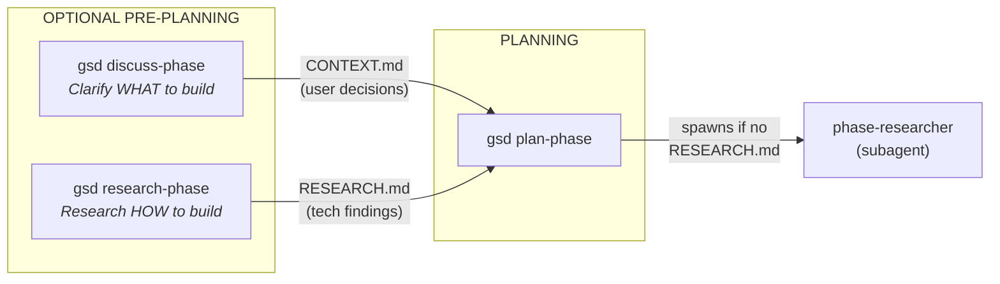
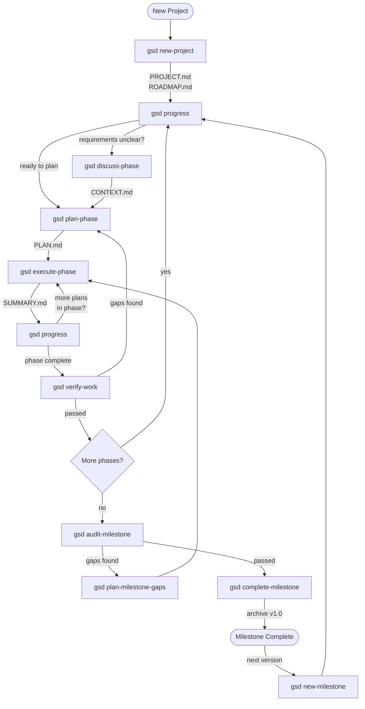
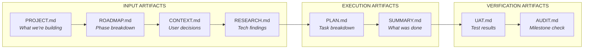

# GSD Agent Architecture

This document explains how all GSD agents connect, their purposes, and when to use each command.

## Overview

### What GSD Solves

GSD (Get Shit Done) is a meta-prompting system that solves **context rot** — the quality degradation that occurs as Claude fills its context window with conversation history, failed attempts, and tangential exploration.

### The Solution: Fresh Context Per Task

Instead of one long conversation, GSD orchestrates **specialized agents** that each start with a fresh 200k context window. Each agent:
- Has a focused role (researcher, planner, executor)
- Receives only the context it needs
- Produces a specific artifact (RESEARCH.md, PLAN.md, SUMMARY.md)
- Terminates, freeing its context

### Agent Categories

| Category | Count | Purpose | User-Invokable? |
|----------|-------|---------|-----------------|
| **Orchestrators** | 9 | Coordinate subagents, manage workflows | Yes |
| **Subagents** | 10 | Do specialized work with fresh context | No (spawned by orchestrators) |
| **Commands** | 10 | Standalone actions on planning artifacts | Yes |
| **Utilities** | 8 | Helper functions and settings | Yes |

---

## Agent Dependency Map

This diagram shows which orchestrators spawn which subagents:

```mermaid
flowchart TB
    subgraph orch["ORCHESTRATORS (user-invokable)"]
        plan-phase["gsd plan-phase"]
        execute-phase["gsd execute-phase"]
        new-project["gsd new-project"]
        new-milestone["gsd new-milestone"]
        debug["gsd debug"]
        map-codebase["gsd map-codebase"]
        verify-work["gsd verify-work"]
        audit-milestone["gsd audit-milestone"]
        quick["gsd quick"]
    end

    subgraph sub["SUBAGENTS (spawned, not user-invokable)"]
        phase-researcher["phase-researcher"]
        project-researcher["project-researcher"]
        research-synthesizer["research-synthesizer"]
        roadmapper["roadmapper"]
        planner["planner"]
        plan-checker["plan-checker"]
        executor["executor"]
        verifier["verifier"]
        debugger["debugger"]
        integration-checker["integration-checker"]
        codebase-mapper["codebase-mapper"]
    end

    plan-phase --> phase-researcher
    plan-phase --> planner
    plan-phase --> plan-checker

    execute-phase --> executor

    new-project --> project-researcher
    new-project --> roadmapper

    new-milestone --> project-researcher
    new-milestone --> research-synthesizer
    new-milestone --> roadmapper

    debug --> debugger

    map-codebase --> codebase-mapper

    verify-work --> planner
    verify-work --> plan-checker
    verify-work --> debugger

    audit-milestone --> integration-checker

    quick --> phase-researcher
    quick --> planner
    quick --> plan-checker
    quick --> executor
    quick --> verifier
```



---

## Pre-Planning Workflow

Before planning a phase, you can optionally gather context:



### When to Use Each

| Command | Purpose | Output | Use When |
|---------|---------|--------|----------|
| `gsd discuss-phase` | Product Owner conversation | CONTEXT.md | Requirements are unclear, need user decisions |
| `gsd research-phase` | Technical investigation | RESEARCH.md | Tech approach is unclear, need library research |
| `gsd plan-phase` | Create execution plan | PLAN.md | Ready to plan (auto-researches if needed) |

---

## Full Project Lifecycle



---

## Complete Agent Reference

### Orchestrators (9)

| Agent | Description | Spawns |
|-------|-------------|--------|
| `gsd-plan-phase` | Create detailed execution plans | phase-researcher, planner, plan-checker |
| `gsd-execute-phase` | Execute plans with atomic commits | executor |
| `gsd-new-project` | Initialize new project with research | project-researcher, roadmapper |
| `gsd-new-milestone` | Start new milestone cycle | project-researcher, research-synthesizer, roadmapper |
| `gsd-debug` | Systematic debugging | debugger |
| `gsd-map-codebase` | Analyze codebase structure | codebase-mapper (parallel) |
| `gsd-verify-work` | User acceptance testing | planner, plan-checker, debugger |
| `gsd-audit-milestone` | Verify milestone completion | integration-checker |
| `gsd-quick` | Quick tasks (skip research/verification) | phase-researcher, planner, plan-checker, executor, verifier |

### Subagents (10)

| Agent | Spawned By | Purpose |
|-------|------------|---------|
| `phase-researcher` | plan-phase, quick | Research tech domain for a phase |
| `project-researcher` | new-project, new-milestone | Research project ecosystem |
| `research-synthesizer` | new-milestone | Synthesize parallel research outputs |
| `roadmapper` | new-project, new-milestone | Create phase breakdown from requirements |
| `planner` | plan-phase, verify-work, quick | Create task-level execution plans |
| `plan-checker` | plan-phase, verify-work, quick | Verify plans achieve goals |
| `executor` | execute-phase, quick | Execute plan tasks with atomic commits |
| `verifier` | quick | Verify implementation matches intent |
| `debugger` | debug, verify-work | Investigate bugs with scientific method |
| `integration-checker` | audit-milestone | Verify cross-phase integration |
| `codebase-mapper` | map-codebase | Analyze codebase focus areas |

### Commands (10)

| Agent | Description |
|-------|-------------|
| `gsd-progress` | Check progress, route to next action |
| `gsd-add-phase` | Add phase to end of milestone |
| `gsd-insert-phase` | Insert decimal phase for urgent work |
| `gsd-remove-phase` | Remove phase and renumber |
| `gsd-audit-milestone` | Audit milestone before completing |
| `gsd-complete-milestone` | Archive milestone, create git tag |
| `gsd-plan-milestone-gaps` | Create phases from audit gaps |
| `gsd-discuss-phase` | Clarify requirements with user |
| `gsd-list-phase-assumptions` | Surface Claude's assumptions |
| `gsd-research-phase` | Standalone tech research |

### Utilities (8)

| Agent | Description |
|-------|-------------|
| `gsd-quick` | Quick task with GSD guarantees |
| `gsd-pause-work` | Create handoff for pausing |
| `gsd-resume-work` | Restore context from handoff |
| `gsd-add-todo` | Capture idea as todo |
| `gsd-check-todos` | List pending todos |
| `gsd-settings` | Configure workflow toggles |
| `gsd-set-profile` | Switch model profile |
| `gsd-update` | Update GSD to latest version |
| `gsd-help` | Show command reference |
| `gsd-join-discord` | Discord invite link |

---

## Example Scenarios

### Scenario 1: Starting a New Project

```bash
gsd new-project                    # Answer questions, creates PROJECT.md + ROADMAP.md
gsd progress                       # See phase 1, get routing suggestion
gsd discuss-phase 1                # (optional) Clarify requirements
gsd plan-phase 1                   # Create PLAN.md for phase 1
gsd execute-phase 1                # Execute all plans in phase 1
gsd progress                       # Check what's next
```

### Scenario 2: Resuming Work After a Break

```bash
gsd progress                       # Shows current position + next action
# Follow the suggested command (execute-phase, plan-phase, etc.)
```

### Scenario 3: Quick Fix (Skip Full Workflow)

```bash
gsd quick "fix the login button styling"
# Spawns researcher → planner → checker → executor → verifier
# All in one command, writes to .planning/quick/
```

### Scenario 4: Debugging a Problem

```bash
gsd debug "users see 500 error on checkout"
# Spawns debugger with scientific method
# Creates persistent debug session in .planning/debug/
```

### Scenario 5: Requirements Unclear Before Planning

```bash
gsd discuss-phase 3                # Clarify WHAT to build with user
# Creates CONTEXT.md with decisions
gsd plan-phase 3                   # Plan uses CONTEXT.md as input
```

### Scenario 6: Need Tech Research Before Planning

```bash
gsd research-phase 3               # Research libraries, patterns, pitfalls
# Creates RESEARCH.md
gsd plan-phase 3                   # Plan uses RESEARCH.md (skips auto-research)
```

### Scenario 7: Completing a Milestone

```bash
gsd progress                       # Shows "milestone complete"
gsd audit-milestone                # Verify all requirements met
gsd complete-milestone             # Archive, create git tag
gsd new-milestone                  # Start next version cycle
```

---

## Redundancy Notes

Some agents overlap in functionality:

| Standalone Command | Subagent Equivalent | Status |
|--------------------|---------------------|--------|
| `gsd-research-phase` | `phase-researcher` | Consider merging in v1.1 |

The standalone command allows manual invocation, while the subagent is spawned automatically by `plan-phase` when no RESEARCH.md exists.

---

## Artifact Flow



Each artifact flows into the next, providing context for downstream agents while keeping each agent's context window fresh.
